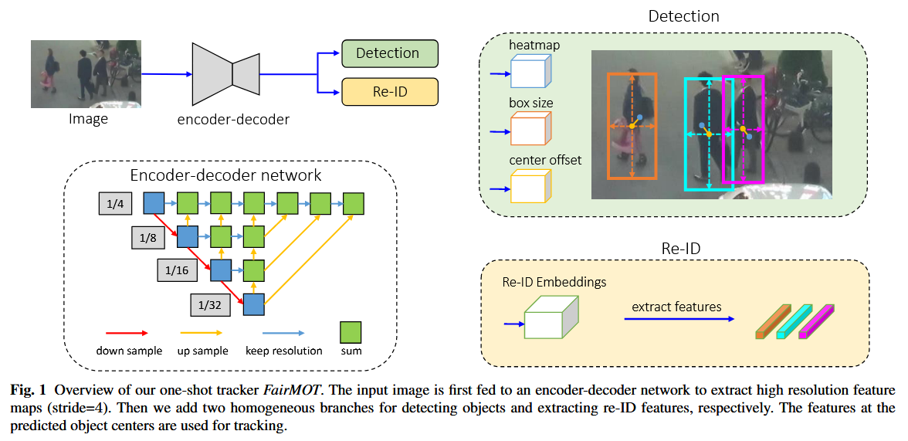

https://arxiv.org/abs/2004.01888

### 训练调试配置
```json
//export LD_LIBRARY_PATH='/usr/local/cuda/lib64/'
{
    "version": "0.2.0",
    "configurations": [
        {
            "name": "Python 调试程序: 当前文件",
            "type": "debugpy",
            "request": "launch",
            "program": "${workspaceFolder}/scripts/train/train.py",
            "console": "integratedTerminal",
            "args": [
                "-c", "ppdet/configs/mot/fairmot/fairmot_dla34_30e_1088x608.yml",
                "-o", 
                // "--eval",
                // "--infer_img", "ppdet/assets/road554.png",
                // "--weights", "output/model_final.pdparams"
            ],
        }
    ]
}
```


### 配置yaml文件
`fairmot_dla34_30e_1088x608`


### 前向传播
`outputs = model(data)`


### 模型架构
`class FairMOT(BaseArch): #FairMOT模型架构`

#### 检测网络（包含主干网络）
`class CenterNet(BaseArch):`


#### reid网络
`class FairMOTEmbeddingHead(nn.Layer):`


#### 初始化数据处理

**数据集加载**
`class MOTDataSet(DetDataset):`

**数据读取**
`class TrainReader(BaseDataLoader): #数据集读取外加数据增强`

**批数据集处理**
`class Gt2FairMOTTarget(Gt2TTFTarget):`


```yaml
TrainReader:
  inputs_def:
    image_shape: [3, 608, 1088]
  sample_transforms:
    - Decode: {}
    - RGBReverse: {}
    - AugmentHSV: {}
    - LetterBoxResize: {target_size: [608, 1088]}
    - MOTRandomAffine: {reject_outside: False}
    - RandomFlip: {}
    - BboxXYXY2XYWH: {}
    - NormalizeBox: {}
    - NormalizeImage: {mean: [0, 0, 0], std: [1, 1, 1]}
    - RGBReverse: {}
    - Permute: {}
  batch_transforms:
    - Gt2FairMOTTarget: {}
  batch_size: 2
  shuffle: True
  drop_last: True
  use_shared_memory: True
```